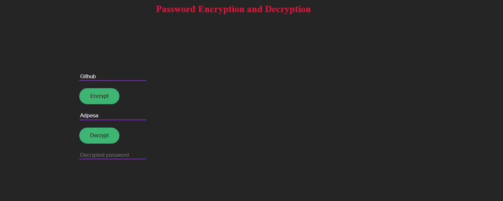
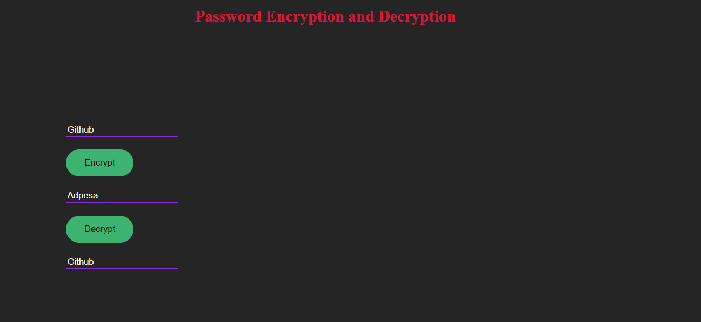

# Password Encryption and Decryption

A simple web application that allows users to encrypt and decrypt their passwords.

## Usage

1. Enter your normal password in the input field.
2. Click on the "Encrypt" button to convert your normal password to an encrypted form.
3. Click on the "Decrypt" button to convert the encrypted password back to its normal form.

## Example

- Normal password: `Github`
- Encrypted password: `Adpesa`

## Screenshots

[](https://kabilankavi131.github.io/Encrypt-Decrypt_your_password/)
*Screenshot of the encryption process*

[](https://kabilankavi131.github.io/Encrypt-Decrypt_your_password/)
*Screenshot of the decryption process*

## Installation

1. Clone the repository:
   ```bash
   git clone https://github.com/[Your Username]/[Your Repository].git
